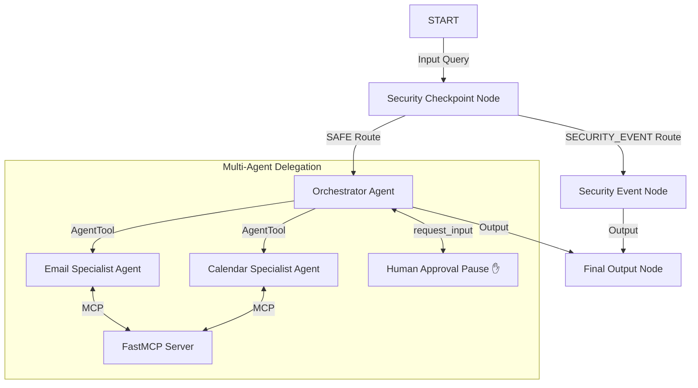

# Submission Write-Up: Inbox Secretary

## Problem Statement
In today's digital environment, managing the influx of daily communications and calendar appointments takes significant cognitive effort. Existing email and calendar automation tools are either too rigid (based on simple regex triggers) or lack secure guardrails. The **Inbox Secretary** resolves this by providing a smart, conversational assistant that acts as a secure buffer to classify incoming communications, draft responses, and schedules events, all under human supervision.

## Solution Architecture
The assistant is built on a robust graph-based workflow. Input queries pass through a security filter before reaching the agent orchestra.

## Concepts Used

1. **ADK Workflow**: Configured in [app/agent.py](file:///c:/Users/venka/OneDrive/Desktop/kaggle/inbox-secretary/app/agent.py#L98-L109), using ADK 2.0 graph API with function nodes (`security_checkpoint`, `security_event_node`, `final_output_node`) and directed edges linking the pipeline.
2. **LlmAgent**: Three separate LLM-based agents are defined in [app/agent.py](file:///c:/Users/venka/OneDrive/Desktop/kaggle/inbox-secretary/app/agent.py#L32-L73): `orchestrator_agent`, `email_agent`, and `calendar_agent`.
3. **AgentTool**: Utilized in [app/agent.py](file:///c:/Users/venka/OneDrive/Desktop/kaggle/inbox-secretary/app/agent.py#L71) to wrap `email_agent` and `calendar_agent` as tools for the main `orchestrator_agent`.
4. **MCP Server**: Defined in [app/mcp_server.py](file:///c:/Users/venka/OneDrive/Desktop/kaggle/inbox-secretary/app/mcp_server.py). The server uses stdio transport to expose tools to `email_agent` and `calendar_agent` via the ADK `McpToolset`.
5. **Security Checkpoint**: Implemented in [app/agent.py](file:///c:/Users/venka/OneDrive/Desktop/kaggle/inbox-secretary/app/agent.py#L78-L125) as a static workflow node executing regex scrubbing, prompt injection detection, and spam filtering.
6. **Agents CLI**: Scaffolding was initiated using the CLI (`agents-cli scaffold create`), and dependencies are pinned in `pyproject.toml`.

## Security Design
* **PII Scrubbing**: Built-in regular expressions screen inputs for Credit Cards, Social Security Numbers, and Phone Numbers. This ensures user privacy is protected before any data reaches the LLM.
* **Prompt Injection Defense**: Keyword scanning intercepts override sequences (e.g. *"ignore previous instructions"*), routing malicious requests away from the coordinator to protect the system's integrity.
* **Domain spam filter**: Common spam triggers (e.g., *"lottery winner"*, *"free cash bonus"*) are blocked at the perimeter to prevent the agent from processing unsafe commercial content.
* **Structured Audit Logging**: Outputs are logged as structured JSON objects with severity levels (`INFO`, `WARNING`, `CRITICAL`), making it easy to feed events into security information systems.

## MCP Server Design
The FastMCP server exposes three tools:
1. **`list_emails`**: Returns a list of inbox emails, helping the email agent find context.
2. **`send_email_reply`**: Simulates sending a reply.
3. **`schedule_calendar_event`**: Commits an event date/time block to the local mock database.

## Human-in-the-Loop (HITL) Flow
To protect against hallucination and unintended actions, a Human-in-the-Loop (HITL) boundary is established using the `request_input` tool. The orchestrator must call `request_input` with the proposed draft email or event details, pausing execution until the user manually confirms or adjusts the details.

## Demo Walkthrough
Refer to the three test cases in the [README.md](file:///c:/Users/venka/OneDrive/Desktop/kaggle/inbox-secretary/README.md#L45-L79):
1. **Normal Flow**: Demonstrates email listing, response drafting, calendar parsing, and human-in-the-loop approval.
2. **Prompt Injection Block**: Demonstrates real-time interception of system override commands.
3. **Spam Filtering**: Demonstrates the domain-specific block of commercial solicitation.

## Impact / Value Statement
The **Inbox Secretary** streamlines day-to-day coordination for busy professionals, saving hours weekly. By automating tedious email drafting and scheduling while maintaining rigid security guardrails and human supervision, it bridges the gap between efficiency and risk-averse execution.
